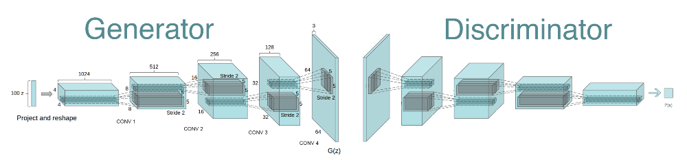

## Generative Adversarial Nets Models

This folder contains Vanilla GAN and DCGAN for fashion generation. The image below present the GAN structure with MNIST dataset. In my case I will use t-shirt images.

I would recommend, for those who are not familiar with a GAN concept, to watch [NIPS 2016 Workshop on Adversarial Training](https://www.youtube.com/playlist?list=PLJscN9YDD1buxCitmej1pjJkR5PMhenTF) or to read this [blogpost](https://towardsdatascience.com/understanding-generative-adversarial-networks-4dafc963f2ef) to get a nice overview of GAN model.

### Manual
If you want to generate images then first you need to choose input images for discriminator and set the PATH in the model.py to the folder on your laptop.
Thereafter you can just run the model.py and observe generated images in the out folder

### Models
I was wondering can I generate a fancy t-shirt using latest trends. Therefore, I decided to use GAN in this mission to be ready for the next summer season.
#### Vanilla GAN
I have used around 100 nice t-shirts for the discriminator, Vanilla GAN and 57k epochs to get this result:

Not nice so far. Maybe because Vanilla GAN has only 2 DNN layers in generator and descriminator. 

#### DCGAN
The next step is to use Deep Convolutional GAN (DCGAN), which has convolutional layers and batch normalization that are supposed to help with the stability of the convergence. The original DCGAN uses 4 convolutional layers presented on the image below. 

In my implementation I used only 3 layers to speed up calculations. Even with faster architecture I made only 20k epochs. Therefore, I suppose the result has to be better with 4 layers and more epochs. Also tuning the hyperparameters of model may help to improve the result.   

It looks that in both cases the generator learns the shape of t-shirts and in case of DCGAN performs better color generation. All t-shirts in train dataset have different design, color and prints that make this task quite difficult for the GAN.

