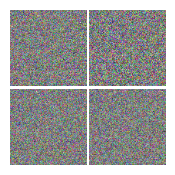

## Generative Adversarial Nets Models

This folder contains the GAN models for fashion generation.

The first implemented model is a Vanilla GAN. Later it will be compared with DCGAN.
I would recommend, for those who are not familiar with a GAN concept, to read this [blogpost](https://towardsdatascience.com/understanding-generative-adversarial-networks-4dafc963f2ef) to get a nice overview of GAN model.

### Manual

If you want to generate images then first you need to choose input images for discriminator and set the PATH in the model.py to the folder on your laptop.
Thereafter you can just run the model.py and observe generated images in the out folder

Since I was wondering can I generate a fancy t-shirt using latest trends, I decided to use GAN in this mission to be ready for the next summer season.
I have used around 100 nice t-shirts for the discriminator and I got this result):

Not nice so far. Therefore the next step is to use DCGAN, which has convolutional layers and batch normalization that are supposed to help with the stability of the convergence.
It also would be interesting to compare results and performance of these models.

To be continued.....
