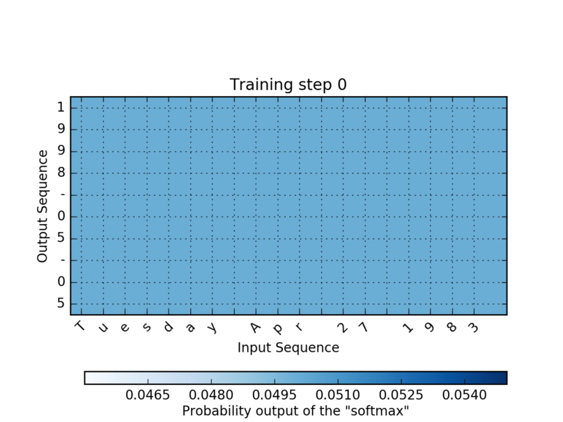

## Neural Machine Translation

This folder contains bidirectional LSTM model with attention mechanism that help us to translate dates with arbitrary format to machnie format like shown on the example below.   
  
tuesday july 8 2008 -> 2008-07-08  
08 sep 1999 -> 1999-09-08  
 
It was my project in one of the online courses and I decided to leave this example with date translation because of the computational simplicity. 

I would like to demonstrate the behaviour of the attention mechanism during the learning process. It is extremly cool to observe how model trying to figure out how to translate the input date to a specific format. You can change "your_date" paramiter in the model to see how it will work with your example.

#### Attention
I have used around 100 nice t-shirts for the discriminator, Vanilla GAN and 57k epochs to get this result:

At the end, I run the model trained with 20 epochs to translate several dates. Here is the result:  
input : 3 May 1979  
output: 1979-05-03  
input : 5 April 09  
output: 2009-04-05  
input : 21th of August 2016  
output: 2016-07-22  
input : Tue 10 Jul 2007  
output: 2007-07-10  
input : Saturday May 9 2018  
output: 2018-05-09  
input : March 3 2001  
output: 2001-03-03  
input : March 3rd 2001  
output: 2001-03-33  
input : 1 March 2001  
output: 2000-03-01  

As you can see the model still can make mystakes).
