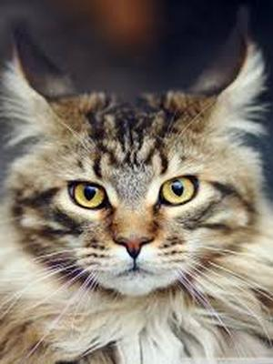
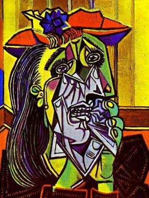
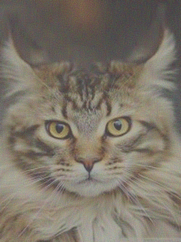
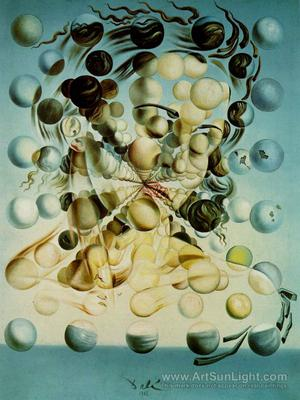

This folder contains the model for art generation by Neural Style Transfer.

In order to use this model you need to download the pretrained model imagenet-vgg-verydeep-19.mat from http://www.vlfeat.org/matconvnet/pretrained/ to the folder "pretrained_model".
Then you can run model.py to generate images presented in output folders.
If you want to generate your own image then you need to choose content and style images and put them in images folder.

Since, I like cats and artworks of Dali and Picasso, I have generated two examples with a cat in Picasso and Dali styles. You can even try to exclude cat and use one artwork as a content image with another as style one.

<table width="100%">
    <tr>
        <td></td>
        <td>
</td>
        <td align="right"></td>
    </tr>

Example with Picasso

<table width="100%">
    <tr>
        <td></td>
        <td>
</td>
        <td align="right"></td>
    </tr>

And example with Dali
