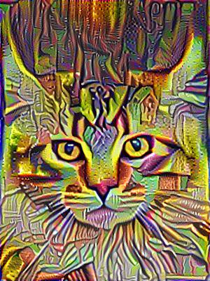
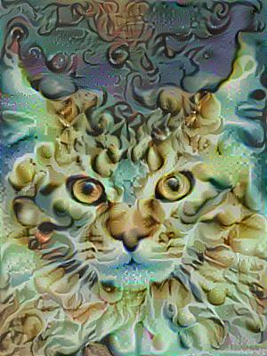

This folder contains the model for art generation by Neural style transfer.
There are two examples with a cat in Picasso adn Dali styles

<table width="100%">
    <tr>
        <td></td>
        <td>
</td>
        <td align="right"></td>
    </tr>

Example with Picasso

<table width="100%">
    <tr>
        <td></td>
        <td>
</td>
        <td align="right"></td>
    </tr>

And example with Dali

In order to use this model you need to download the pretrained model imagenet-vgg-verydeep-19.mat from http://www.vlfeat.org/matconvnet/pretrained/
Then you can run model.py to generate images presented in output folders.
If you want to generate your image then you need to choose content and style image and put them in images folder.
